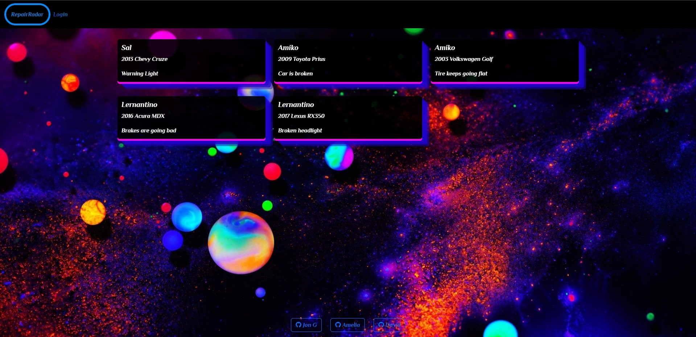

# RepairRadar 
 
- First and Foremost SHOUTOUT to the collaborators [DavidLove](https://github.com/Cyril1743) [AmeliaBigler](https://github.com/AmeliaBigler) and [JonGuhl](https://github.com/JonathanGuhl) for making this happen! 

## Description

- RepairRadar allows mechanics the ability to connect with potential customers in ways like never before. 

- The goal of RepairRadar is to help mechanics find side work and also help clients hopefully get their car fixed for rates that are cheaper than dealerships and auto repair shops.

- Users of the website can post tickets which will describe whatever problem they're having on their car. 

- Mechanics can then find these tickets and bid on them based on the wages they desire to complete the work.

- Users and Mechanics can communicate through the application after a bid has been placed so they can work out details of how business will be handled or anything else they desire to discuss.

## Usage

- [Link to deployed app](https://repairradar.herokuapp.com)

## Technologies Used 

- [NodeJs](https://nodejs.org/en/download/)

- [Sequelize](https://sequelize.org/api/v6/class/src/sequelize.js~sequelize)

- [Heroku](https://id.heroku.com/login)

- [Handlebars](https://handlebarsjs.com/)

- [SocketIO](https://socket.io/)

- [Express](https://expressjs.com/)

- [NodeMailer](https://nodemailer.com/about/)

## Screenshot

